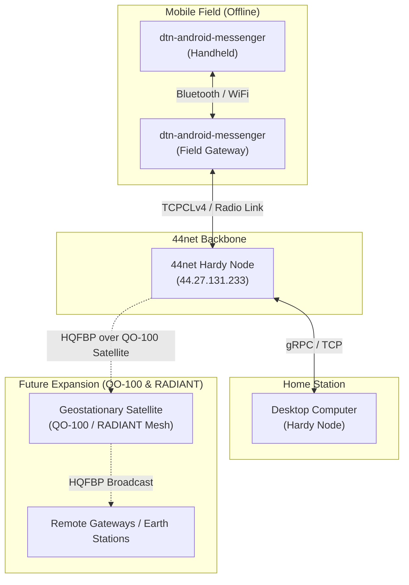

*This is the sixth and final post in a series exploring [Delay-Tolerant Networking (DTN)](https://w.fejoz.net/tags/#dtn) and resilient communication stacks built for amateur radio, space payloads, and emergency networks.*

---

## From Local Nodes to a Global Mesh

To test delay-tolerant networks under real conditions, we need to move past offline loopback simulations and phone-to-phone tests. We need a persistent backbone infrastructure that peers can connect to, exchange bundles, and fetch asynchronous resources.

To address this, we deployed a public instance of the **Hardy** BPA server on the amateur radio IP network (AMPRNet / 44net).

---

## The Network Architecture

Our current testing infrastructure bridges mobile field clients with local desktop machines through this public backbone node.



In this model:
* Field operators use **`dtn-android-messenger`** to chat, share files, and collect SenML weather telemetry.
* Devices synchronize opportunistically via Bluetooth or local Wi-Fi.
* Once a gateway node gets connectivity to the 44net backbone (either via internet-VPN tunnels or RF ham links), it connects to the public Hardy node at **`44.27.131.233`** using the TCPCLv4 convergence layer.
* The public node acts as a persistent mailbox, routing bundles back to home stations or local desktop setups.

---

## Peering Configuration

*Note: Hardy uses YAML for its server configuration, alongside a custom line-by-line configuration for static routing rules.*

To peer your local Hardy node with the public gateway, add the connection under the `clas` section of your configuration file:

```yaml
# In /etc/hardy/my-config.yaml
clas:
  - name: tcpcl-44net-gateway
    type: tcpclv4
    address: "[::]:4556" # local listening port
    require-tls: false   # disabled for amateur radio compliance
    peers:
      - "44.27.131.233:4556" # outbound connection to the public node
```

Then, configure a static route rule to send any bundle matching a destination EID pattern through the gateway:

```text
# In /etc/hardy/static_routes
# Route all dtn:// traffic via the 44net gateway EID
dtn://*/** via dtn://44net-hardy-gateway/
```

---

## The Next Step: QO-100 and the RADIANT Project

While internet-backed tunnels on 44net are excellent for testing the network layer, the ultimate goal of amateur radio is autonomous RF routing. 

Thanks to the **RADIANT project** (sponsored by AMSAT-UK), we are working to extend this DTN infrastructure to satellite links. The geostationary satellite **QO-100** (Qatar-OSCAR 100) provides a continuous amateur radio transponder spanning Europe, Africa, and parts of Asia.

Tomorrow, instead of relying on terrestrial routes:
* We will transmit HQFBP broadcast frames directly up to **QO-100**.
* Ground stations across the satellite's footprint will receive and reassemble the bundles using the `hardy-hqfbp-cla` adapter.
* This will form a geostationary delay-tolerant mesh network, providing emergency communications and weather feeds to remote stations completely independent of the commercial internet.

---

## Conclusion

Over this six-part series, we have built a complete, open-source, delay-tolerant stack for the modern ham radio operator:
1. **Link Layer:** Optimizing file transfers with **HQFBP** and simulating bit error rates.
2. **Network Layer:** Running the high-performance Rust **Hardy** BPA daemon.
3. **CLI Utilities:** Automating actions on incoming bundles with `dtntrigger` and `dtn-hdy-utils`.
4. **Mobile Clients:** Taking DTN into the field with a native **Kotlin Android Messenger** featuring SenML telemetry dashboard.
5. **Application Protocol:** Requesting resources asynchronously with the **Basket Protocol**.
6. **Community Deployment:** Peering over **44net** and look ahead to satellite missions.

The code is open, the public gateway is live, and the mesh is waiting for your packets. 73!
